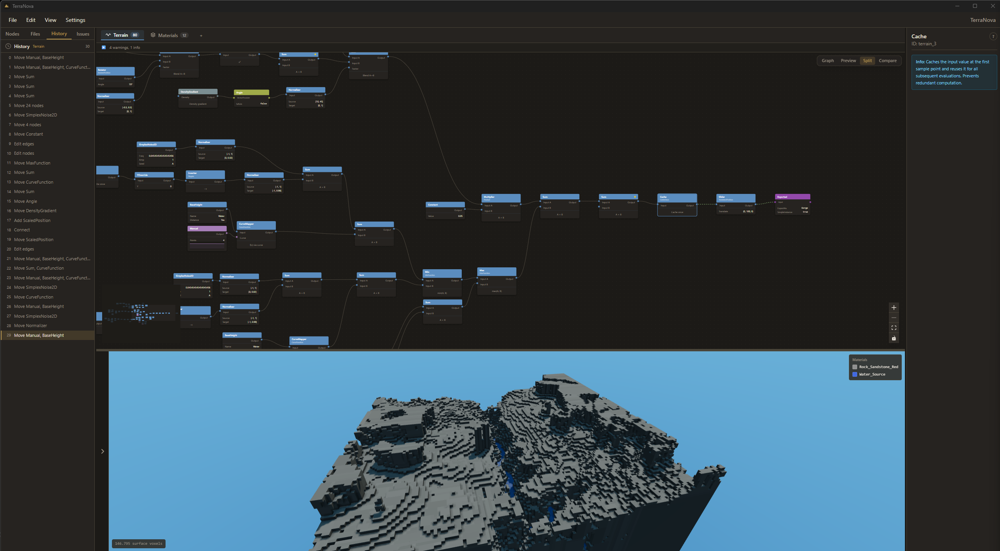

# TerraNova

[](https://github.com/HyperSystemsDev/TerraNova/releases)
[](LICENSE)
[](https://discord.gg/NHPzsjkQeu)
[](https://github.com/HyperSystemsDev/TerraNova)

**Offline design studio for Hytale World Generation V2.** Visual node editor, live terrain preview, and validated JSON export — no server required.

**[Releases](https://github.com/HyperSystemsDev/TerraNova/releases)** | **[Discord](https://discord.gg/NHPzsjkQeu)** | **[Changelog](docs/CHANGELOG.md)**



## Features

**Node-Based Editor** — Drag-and-drop all 200+ V2 types with category-colored nodes. Auto-layout via dagre, minimap navigation, node search, copy/paste, snap-to-grid, and full undo/redo with descriptive history labels.

**Live Preview** — Real-time 2D heatmaps with contour lines, cross-sections, and position overlays. 3D voxel heightfield preview with SSAO post-processing. Five colormaps (Blue-Red, Grayscale, Terrain, Viridis, Red-Black) with configurable bounds.

**Comparison View** — Side-by-side before/after preview for iterating on terrain changes. See exactly what your edits do without leaving the editor.

**Biome Editor** — Edit Terrain, Material, Pattern, Position, and Prop sections within a single biome file. Per-section undo history, noise range editor for biome boundaries, and a rich dashboard with material layer overview and prop summary.

**Curve Editor** — Interactive canvas with draggable control points for Manual curves. Read-only computed previews for all built-in types (SquareBump, InverseLerp, etc.). Snap-to-grid, interpolation modes, presets, and mini curve previews in node bodies.

**Material Layers** — Visual stack editor for material providers with layer ordering and full V2 SpaceAndDepth specification support.

**Template System** — 10 bundled templates (Void, Forest, Forest Hills, Desert, Mountains, Floating Islands, Eldritch Spirelands, Shattered Archipelago, Tropical Pirate Islands) plus snippet templates for common node patterns. Create and share your own.

**Schema Validation** — Real-time diagnostics on type errors, missing fields, and invalid ranges. Error, warning, and info badges appear directly on nodes so you know exactly what to fix before exporting.

**Bridge Integration** — Connect to a running Hytale server and push exported asset packs directly. Design offline, deploy in one click.

**Full V2 Coverage** — 68 density types, 14 material providers, 19 curves, plus patterns, positions, props, scanners, vectors, environments, assignments, tints, block masks, and world structures.

**Offline-First** — No server, no internet, no telemetry. Under 15MB install. All data stays on your machine.

## Quick Start

1. Download the latest release from [Releases](https://github.com/HyperSystemsDev/TerraNova/releases)
2. Open TerraNova, pick a template or start from scratch
3. Design your worldgen using the node editor and live preview
4. Export and drop the JSON files in your server's `mods/` folder

<details>
<summary><strong>macOS: App Won't Open / "Unverified Developer"</strong></summary>

TerraNova is not yet signed with an Apple Developer certificate. macOS may block the app on first launch. Use one of these methods:

**Method 1 — Right-click Open (recommended)**
1. Right-click (or Control-click) TerraNova in Applications
2. Select "Open" from the context menu
3. Click "Open" in the dialog that appears

**Method 2 — Terminal command**
```bash
xattr -cr /Applications/TerraNova.app
```
Then launch normally.

**Method 3 — System Settings**
1. Open **System Settings → Privacy & Security**
2. Scroll to the Security section — you'll see a message about TerraNova being blocked
3. Click **"Open Anyway"**

> These steps are only needed once. Subsequent launches will work normally.

</details>

## Keyboard Shortcuts

| Shortcut | Action |
|----------|--------|
| `Ctrl+Z` / `Ctrl+Y` | Undo / Redo |
| `Ctrl+S` | Save |
| `Ctrl+F` | Search nodes |
| `Ctrl+A` | Select all |
| `Delete` | Delete selected |
| `Ctrl+D` | Duplicate selected |
| `Ctrl+L` | Auto-layout graph |
| `Space` (drag) | Pan canvas |
| `Scroll` | Zoom |

<details>
<summary><strong>All shortcuts</strong></summary>

| Shortcut | Action |
|----------|--------|
| `Ctrl+N` | New file |
| `Ctrl+O` | Open file |
| `Ctrl+Shift+S` | Save as |
| `Ctrl+E` | Export JSON |
| `Ctrl+B` | Toggle sidebar |
| `Ctrl+P` | Toggle preview |
| `Ctrl+G` | Toggle grid |
| `Ctrl+M` | Toggle minimap |
| `Escape` | Deselect / close dialog |

</details>

## Technology Stack

| Layer | Technology |
|-------|-----------|
| Framework | [Tauri 2](https://tauri.app/) |
| Frontend | [React 19](https://react.dev/) + [TypeScript](https://www.typescriptlang.org/) |
| Node Editor | [@xyflow/react](https://reactflow.dev/) (React Flow) |
| 3D Preview | [React Three Fiber](https://r3f.docs.pmnd.rs/) + [Three.js](https://threejs.org/) |
| State | [Zustand](https://zustand.docs.pmnd.rs/) |
| Styling | [Tailwind CSS](https://tailwindcss.com/) |
| Build | [Vite](https://vite.dev/) with code-split chunks |
| Backend | [Rust](https://www.rust-lang.org/) |
| Noise | [fastnoise-lite](https://github.com/Auburn/FastNoiseLite) |

## Performance

- **O(1) Node Rendering** — `React.memo` with hoisted handle arrays, so only changed nodes re-render (not all 200)
- **Instant Undo/Redo** — History snapshots restored by reference, under 1ms even at 200 nodes
- **Lazy 3D Loading** — Three.js + post-processing (~1.1 MB) loaded on demand, keeping initial load at ~580 KB
- **Bounded Memory** — History caps (50 global / 30 per-section) and LRU file cache eviction (10 files)
- **Chunk Splitting** — Vite splits Three.js, ReactFlow, and dagre into separate chunks for parallel loading

> TerraNova uses [Tauri](https://tauri.app/) instead of Electron — baseline memory is ~80-120 MB (system WebView) vs ~300-500 MB (bundled Chromium).

<details>
<summary><strong>System Requirements</strong></summary>

### Minimum
*Basic editing: up to ~50 nodes, 2D heatmap preview, 1-2 files open*

| Component | Spec |
|-----------|------|
| CPU | Dual-core, 2.0 GHz (Intel i3 8th gen / Ryzen 3 3200G / Apple M1) |
| RAM | 4 GB |
| GPU | Integrated with WebGL 2.0 (Intel UHD 620 / AMD Vega 3) |
| Storage | 200 MB free |
| Display | 1280x720 |
| OS | Windows 10 21H2+ / macOS 11+ / Ubuntu 22.04+ |

### Recommended
*Full workflow: 100-200 nodes, 3D voxel preview, split view, 5+ biome sections*

| Component | Spec |
|-----------|------|
| CPU | Quad-core, 3.0 GHz (Intel i5 10th gen / Ryzen 5 3600 / Apple M1) |
| RAM | 8 GB |
| GPU | Dedicated with 2GB VRAM or strong integrated (GTX 1050+ / Iris Xe / Apple M1) |
| Storage | SSD |
| Display | 1920x1080 |

</details>

## Development

<details>
<summary><strong>Prerequisites & setup</strong></summary>

**Requirements:** [Node.js](https://nodejs.org/) 20+, [pnpm](https://pnpm.io/) 9+, [Rust](https://rustup.rs/) 1.77+

```bash
# Install frontend dependencies
pnpm install

# Launch in development mode (opens app window with hot reload)
pnpm tauri dev
```

### Build

```bash
# Build production bundle
pnpm tauri build
# Output: src-tauri/target/release/bundle/
```

</details>

<details>
<summary><strong>Project structure</strong></summary>

```
TerraNova/
├── src/                    # React frontend (TypeScript)
│   ├── components/         # UI components (editor, preview, layout, home)
│   ├── nodes/              # React Flow node components per V2 category
│   │   ├── density/        #   68 density function node types
│   │   ├── material/       #   14 material provider node types
│   │   ├── curves/         #   19 curve node types
│   │   └── shared/         #   BaseNode, handle registry, layout
│   ├── schema/             # TypeScript type definitions for V2 assets
│   ├── stores/             # Zustand state stores
│   ├── hooks/              # Custom React hooks
│   └── utils/              # Graph conversion, layout, colormaps
├── src-tauri/              # Tauri + Rust backend
│   └── src/
│       ├── commands/       #   Tauri command handlers
│       ├── schema/         #   Rust V2 schema types (serde)
│       ├── noise/          #   Density function evaluator
│       └── io/             #   Asset pack I/O and template system
├── templates/              # Bundled world generation templates
└── public/                 # Static assets
```

</details>

## Links

- [Releases](https://github.com/HyperSystemsDev/TerraNova/releases) — Downloads
- [Changelog](docs/CHANGELOG.md) — Version history
- [Discord](https://discord.gg/NHPzsjkQeu) — Support & community
- [Issues](https://github.com/HyperSystemsDev/TerraNova/issues) — Bug reports & features
- [HyperSystemsDev](https://github.com/HyperSystemsDev) — Organization

## License

[LGPL-2.1](LICENSE)

## Built with AI

TerraNova is developed with assistance from AI tooling. We believe in being upfront about how this project is built — read the full breakdown in our [AI Transparency & Usage Disclaimer](docs/AI_TRANSPARENCY.md).

---

Part of the **HyperSystems** suite: [HyperPerms](https://github.com/HyperSystemsDev/HyperPerms) | [HyperHomes](https://github.com/HyperSystemsDev/HyperHomes) | [HyperFactions](https://github.com/HyperSystemsDev/HyperFactions) | [TerraNova](https://github.com/HyperSystemsDev/TerraNova)
